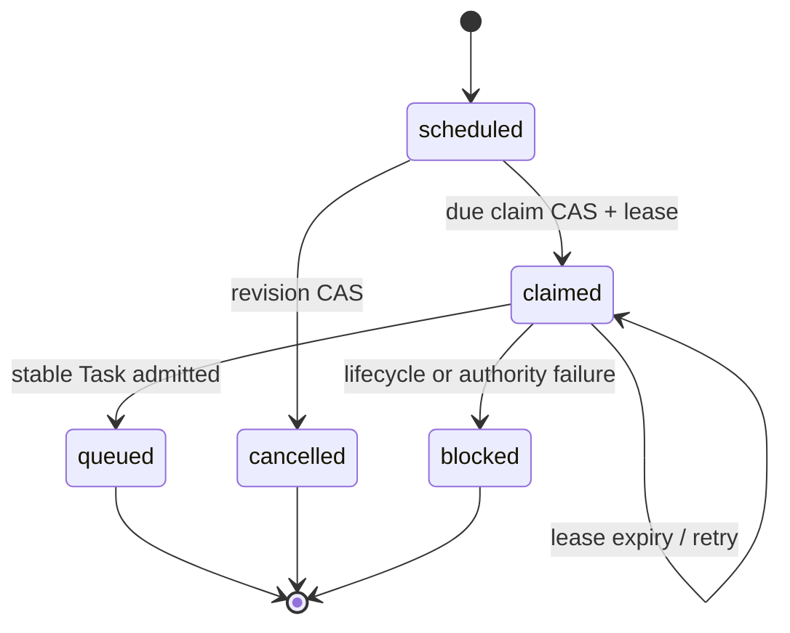

# Session memory and reminders POC architecture

## Why a new Session-owned resource

The existing transcript and provider SDK state preserve conversation history,
but compaction controls what remains readily recallable. Teammate `MEMORY.md`
files are branch-backed and therefore shared by every Session on that teammate
branch. Knowledge is a tenant-owned document graph intended for deliberate
sharing under namespace ACLs. Branch schedules are recurring cron definitions
that create fresh Sessions. None is equivalent to private, durable working
memory plus a one-shot resume of the same Session.

Accordingly, `session_memories` and `session_reminders` are children of
`sessions`. The worktree is only an execution dependency. Soft Session archive
preserves both; hard Session/branch deletion cascades them.

## Reminder state machine

Every daemon performs a bounded indexed due scan. PostgreSQL system RLS exposes
only overdue routing identities. A worker re-enters tenant scope, claims by CAS,
then leaves the transaction before prompt admission. The Task ID is a stable
hash of the reminder ID. A crash after Task creation but before reminder
settlement therefore reconciles the same Task rather than admitting another.
The prompt route rejects archived Sessions for this internal producer and the
ordinary queue retains busy ordering and power/admission holds.

The queued Task carries `metadata.session_reminder`; generic queued-prompt edit
and prompt compaction treat unknown internal metadata as a barrier, preserving
the immutable reminder identity.

## Authorization and privacy

Agent tools derive the current Session from authenticated MCP context and have
no target Session input. Browser services first authorize Session view; writes
require existing prompt authority (or admin/service authority) and scope every
ID lookup by `session_id`. PostgreSQL rows carry `tenant_id`, use forced RLS,
and tenant-owned service hooks establish the database scope. Search uses a
bounded Session predicate before deterministic escaped substring matching.

The agent receives only a tiny static availability hint. Content is fetched on
demand and is not included in board projections, analytics, callbacks, logs, or
public artifacts. V1 has no automatic Memory-to-Knowledge promotion.
